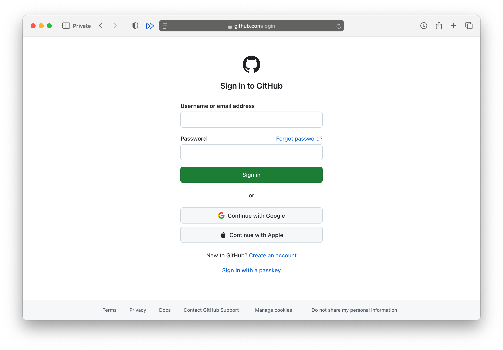
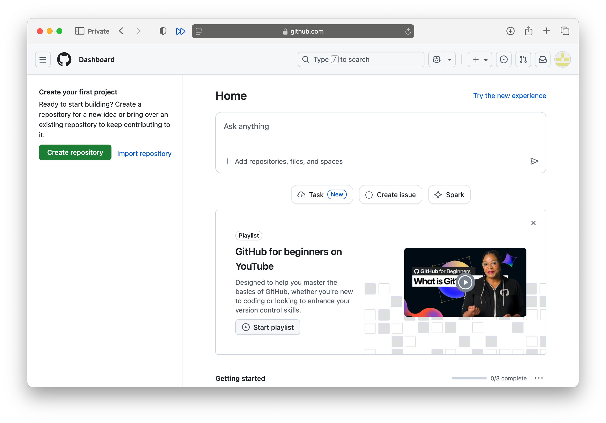

Näide
=====

Põhilised versioneerimise etapid lühikese näitena.

Tühja varamu loomine
++++++++++++++++++++

Loome uue tühja kausta (olemasolevasse kausta `Example`), saagu selle nimeks `tatikas`::

  Example % mkdir tatikas
  Example % cd tatikas

Esialgu on see kaust tühi::
  
  tatikas % ls -l
  total 0

Nagu arvata võib, ei anna ka käsk `git status` mingit mõistlikku tulemust::
  
  tatikas % git status
  fatal: not a git repository (or any of the parent directories): .git

Teeme kausta tühja faili nimega `README.md`::

  tatikas % touch README.md

Nüüd on kaustas `tatikas` üks tühi fail nimega `README.md`.
Lisame sellele failile pisut sisu::

  tatikas % echo "# Tatikas" > README.md

Vaatame, mis selles failis on::

  tatikas % cat README.md
  # Tatikas

Lisame failile veel sisu::

  tatikas % echo -e "\nJaan Tatika elu ja võitlus."

Vaatame, mis selles failis nüüd on::

  tatikas % cat README.md 
  # Tatikas

  Jaan Tatika elu ja võitlus.

Nüüd on kohalikus kaustas üks fail ja selles failis on kaks rida teksti, mis on eraldatud ühe tühja reaga.

Nüüd loome uue tühja faili nimega `elulugu.rst`::

  tatikas % touch elulugu.rst

ja redigeerime seda sobiva tekstitoimetiga. lisades sinna järgmise lõigu

   Kui Jaan Tatikas mitte üle maailma kuulsaks ei ole saanud, siis ei ole see tema laisa tahtmise süü. Tema on selle tarwis sala soowisid salwede kaupa, palawat higi pangede kaupa ära kulutanud. Ta sündis oma esimesel elupäewal ja ilmutas kohe kindlat nõuu, kuulsaks meheks saada, sest temal oli pahema käe küljes paljalt neli sõrme.

See tekst on nüüd failis `elulugu.rst`.

Init
++++

Nüüd loome olemasolevasse kausta uue repositooriumi::

  tatikas$ git init
  hint: Using 'master' as the name for the initial branch. This default branch name
  hint: is subject to change. To configure the initial branch name to use in all
  hint: of your new repositories, which will suppress this warning, call:
  hint: 
  hint:   git config --global init.defaultBranch <name>
  hint: 
  hint: Names commonly chosen instead of 'master' are 'main', 'trunk' and
  hint: 'development'. The just-created branch can be renamed via this command:
  hint: 
  hint:   git branch -m <name>

Nüüd on uus varamu loodud, see on kohalikus masinas. Vaatame, mida ütleb uue varamu kohta `git status`::

  tatikas$ git status
  On branch master

  No commits yet

  Untracked files:
  (use "git add <file>..." to include in what will be committed)
        README.md
        elulugu.rst
        elulugu.rst~

  nothing added to commit but untracked files present (use "git add" to track)

See tähendab, et varamu on loodud, haru on `master`, kuid midagi pole veel ei lisatud ega :term:`kinnitatud<kinnitama>` .

Gitignore
+++++++++

Enne kui "päris" faile hakkame lisama, teeme veel ühe väikese asja ära.
Praegu on näha, et failist `elulugu.rst` on nagu kaks versiooni, teine neist lõppeb tildega (`~`). See on varufail, tagavara, mida võib ju vaja minna, aga mis ei peaks jõudma versioneerimisse.

Selleks et märkida failimustreid, mis ei peakski versioneerimisse minema,
pannakse nad faili, mille nimi on `.gitignore`. Antud juhul siis nii::

  tatikas % touch '.gitignore'
  tatikas % echo '*.~' > .gitignore
  tatikas % cat .gitignore
  *~

See varjab giti käskude eest failid, mis lõppevad tildega. Kui nüüd uuesti vaadata staatust, siis näeb see välja nii::

  tatikas % git status
  On branch master
  Untracked files:
  (use "git add <file>..." to include in what will be committed)
        README.md
        elulugu.rst

  nothing added to commit but untracked files present (use "git add" to track)

Näeme, et tildega fail ei ilmu ka staatuseraportisse.

Failide lisamine ja kinnitamine
+++++++++++++++++++++++++++++++

Lisame esiteks `README.md` faili ja vaatame staatust::

  tatikas % git add README.md 
  tatikas % git status
  On branch master
  Changes to be committed:
     (use "git restore --staged <file>..." to unstage)
        new file:   README.md

  Untracked files:
     (use "git add <file>..." to include in what will be committed)
        elulugu.rst

Giti raamatupidamisse on lisandunud fail `README.md`, see on valmis kinnitamiseks. Faili `elulugu.rst` pole me veel lisanud, see on endiselt mittejälitatava staatuses.

Varamu loomine Githubis
+++++++++++++++++++++++

Olgu meil arendaja nimega Salomon Wesipruul, kes tahab teha uut projekti.
Ta on otsustanud alustada sellest, et loob konto Githubi ja teeb sinna uue varamu.

Githubi sisse logimine
++++++++++++++++++++++

Kui Githubis kontot ei ole, siis tuleb see luua.

	    Githubi avaaken

	    Githubi sisselogimismenüü

